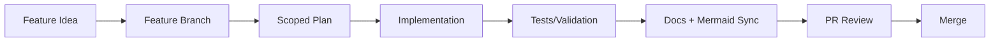

# Workflow Developer Guide

This guide explains the repository workflow for contributors, maintainers, and reviewers.

## Why This Workflow Exists

The project uses a strict workflow to keep changes safe, reviewable, and maintainable as more contributors join:

- dedicated feature branches
- scoped implementation plans before coding
- self-contained docs updates in the same change
- architecture/workflow diagrams aligned with implementation

This reduces hidden decisions, stale docs, and hard-to-review PRs.

## Core Workflow

1. Create a dedicated feature branch.
2. Create a scoped plan (`.agents/plans/*.md`).
3. Implement small, focused changes.
4. Update feature docs (`docs/<feature>/{README,developers,users}.md`).
5. Update Mermaid diagrams for architecture/workflow changes.
6. Run validation checks.
7. Open a PR with implementation + docs together.

## Self-Contained Docs System

The docs model is designed so contributors can understand and modify a feature without external context:

- each feature has `README.md`, `developers.md`, and `users.md`
- architecture/workflow visualizations live in `docs/mermaid/`
- `docs/README.md` is the global index and reading map
- `.agents/` preserves reusable internal project guidance

## How This Keeps PRs Clean

- Scope clarity: branch + plan make intent explicit before code changes.
- Review clarity: implementation and docs change together, reducing ambiguity.
- Change traceability: decisions and workflows are discoverable in one place.
- Lower regression risk: reviewers can validate behavior against updated docs/diagrams.
- Faster onboarding: less tribal knowledge and fewer assumptions in review threads.

## Community Contribution Standards

- Keep changes focused and modular.
- Prefer small PRs over large mixed changes.
- Update docs in the same PR when behavior/workflow changes.
- Keep security boundaries explicit (server-side authz, secrets server-only).
- Avoid undocumented environment/config changes.

## Developer Checklist

Before opening a PR:

1. Branch is feature-scoped and not `main`.
2. Plan exists and matches implementation.
3. Docs are updated (`developers.md`, `users.md`, `README.md`).
4. Mermaid diagrams match runtime/architecture reality.
5. Commands in docs are executable and current.
6. Security and server/client boundaries remain correct.

## Related

- [Workflow User Guide](./users.md)
- [Docs System and Sync Flow](../mermaid/workflow-docs-system.md)
- [Community PR Lifecycle](../mermaid/workflow-community-pr-lifecycle.md)
- [Project Rules](../project/rules.md)
