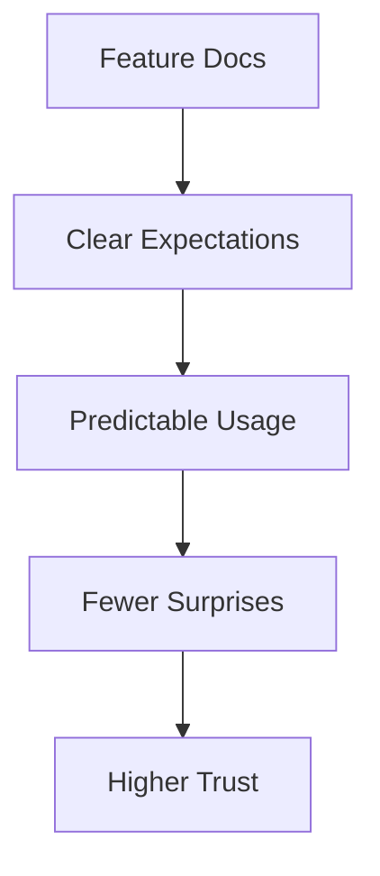

# Workflow User Guide

This guide explains what the repository workflow means for users and community members.

## What You Get As a User

The workflow is not just internal process. It directly improves your experience:

- clearer and more reliable releases
- faster issue resolution
- fewer regressions from undocumented changes
- easier understanding of feature behavior
- predictable contributor quality across the community

## Why Self-Contained Docs Matter To You

Self-contained docs mean each feature explains itself in one place:

- what it does (`users.md`)
- how it works and is maintained (`developers.md`)
- where it fits in the architecture (Mermaid diagrams)

You do not need to reverse-engineer code or read old PRs to understand feature behavior.

## Why Feature Branch Workflow Helps Community Quality

When contributors work on dedicated branches with a scoped plan:

- unrelated changes are less likely to be mixed together
- maintainers can review exactly what changed and why
- rollback and troubleshooting are simpler if issues appear
- merge quality improves because docs, diagrams, and code stay aligned

## PR Quality From A User Perspective

High-quality PR workflow typically leads to:

- more consistent behavior between documentation and product
- safer updates to security-sensitive areas
- better communication of limitations and known constraints
- clearer upgrade paths when workflows evolve

## How To Validate A Feature Quickly

1. Open `docs/<feature>/users.md` for usage and limits.
2. Check `docs/<feature>/README.md` for links.
3. Review the matching Mermaid diagrams in `docs/mermaid/`.
4. Confirm the PR updates all of the above together.

## Community Collaboration Promise

The repository aims to keep community contributions welcoming and high-quality by requiring:

- explicit plans
- focused branches
- synchronized docs
- visible architecture decisions

This helps contributors collaborate without losing clarity as the project grows.

## Related

- [Workflow Developer Guide](./developers.md)
- [Docs System and Sync Flow](../mermaid/workflow-docs-system.md)
- [Community PR Lifecycle](../mermaid/workflow-community-pr-lifecycle.md)
- [Docs Home](../README.md)
